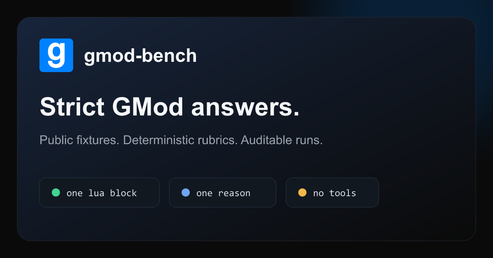

<div align="center">


# gmod-bench

### Find the best AI models for Garry's Mod development

Open coding challenges · verified scores · public evidence

<br />

[](https://gmodbench.com)
[](https://github.com/Iydah/gmod-bench/stargazers)
[](LICENSE)
[](https://bun.sh)
[](https://www.typescriptlang.org/)

<br />

[](https://github.com/Iydah/gmod-bench)
&nbsp;
[](https://gmodbench.com)

<br />

<a href="https://gmodbench.com">
  
</a>

<p>
  <a href="https://gmodbench.com"><strong>gmodbench.com</strong></a>
  ·
  <a href="https://gmodbench.com/leaderboard">Leaderboard</a>
  ·
  <a href="https://gmodbench.com/runs">Runs</a>
  ·
  <a href="https://gmodbench.com/methodology">Methodology</a>
  ·
  <a href="https://gmodbench.com/docs">Docs</a>
</p>

<sub>
  If this helps you pick a model for your next addon —
  <a href="https://github.com/Iydah/gmod-bench/stargazers"><strong>a star means a lot ⭐</strong></a>
</sub>

</div>

---

## Why this exists

GMod addon work is weird: realms, hooks, net messages, prediction, DarkRP quirks, hot-path HUD code. Generic model rankings don’t tell you **which model is actually good at GLua**.

**gmod-bench** runs models through real GMod coding challenges and scores them the same way every time — so you can answer:

> *“Is this model better for my next addon?”*

| What you get | Where |
| --- | --- |
| Live ranks | [gmodbench.com](https://gmodbench.com) |
| Per-run evidence | [gmodbench.com/runs](https://gmodbench.com/runs) |
| How scoring works | [gmodbench.com/methodology](https://gmodbench.com/methodology) |
| This harness | clone · `bun install` · `bun run bench` |

Every prompt, scoring rule, model answer, and result is open for inspection.

---

## Live site

<div align="center">

### 🌐 [gmodbench.com](https://gmodbench.com)

**Compare models · expand rows for evidence · open the runs that produced a rank**

| Surface | Link |
| --- | --- |
| Home & board | [gmodbench.com](https://gmodbench.com) |
| Full leaderboard | [gmodbench.com/leaderboard](https://gmodbench.com/leaderboard) |
| Published runs | [gmodbench.com/runs](https://gmodbench.com/runs) |
| Scoring notes | [gmodbench.com/methodology](https://gmodbench.com/methodology) |

</div>

Models answer a **strict response format** so results stay comparable:

````text
```lua
<code>
```
Reason: <one line>
````

---

## Contents

- [What it measures](#what-it-measures)
- [Quick start](#quick-start)
- [Running the benchmark](#running-the-benchmark)
- [Reading results](#reading-results)
- [Runners and models](#runners-and-models)
- [Methodology](#methodology)
- [Fixtures and scoring](#fixtures-and-scoring)
- [Where results live](#where-results-live)
- [Development](#development)

---

## What it measures

The public suite covers three evidence classes:

- **API correctness** — current GMod primitives, realms, hooks, lifecycle, prediction, networking, storage
- **Micro-performance** — contract-equivalent choices with a measured or documented winner
- **Production addon scenarios** — security, bounds, cleanup, network fanout, persistence, hot-path cost

Performance answers are workload-specific. A one-off `ents.FindInSphere` and a per-tick query over addon-owned entities need different designs, so fixtures state frequency, ownership, bounds, and recipient scope when those facts change the correct answer. Unsafe or behavior-changing “faster” code cannot pass.

The benchmark does **not** execute generated GLua inside a live GMod server. Deterministic scorers validate the answer contract and fixture-specific rules. Read public results as strong regression / compliance evidence — not a guarantee that an arbitrary addon is production-safe.

---

## Quick start

### Requirements

- [Bun](https://bun.sh/) for install, tests, and the CLI
- At least one supported runner:
  - a CLI that `doctor` marks **`strict`**, or
  - an [OpenRouter](https://openrouter.ai/) API key

```sh
bun install
bun run bench doctor
bun run bench list
```

`doctor` is safe — it checks CLI help/version surfaces and OpenRouter readiness and **never** sends a model prompt.

### Run one fixture first

Pick a runner `doctor` reports as `strict` (example: Codex):

```sh
bun run bench run --fixture gmod.player-iterator.v1 --runners codex --repeat 1
```

Targeted fixture IDs always create a new result — fastest way to confirm runner, strict-mode trace, scorer, and artifacts.

**OpenRouter free model:**

```sh
# copy .env.example → .env and set OPENROUTER_API_KEY
bun run bench list-models --free
bun run bench run --fixture gmod.player-iterator.v1 --runners openrouter --model openrouter=provider/model:free
```

Never commit `.env`. Rotate the key if it leaks.

---

## Running the benchmark

### Run only new work

```sh
bun run bench run --fixture all --openrouter-free --concurrency 2
```

With `--fixture all` (or omitted), the harness skips exact historical slots already completed in finished runs. A slot matches adapter, model, fixture version, rubric version, prompt hash, reasoning effort, and repeat index.

History policy defaults to `--history-policy scored`:

| Policy | Behavior |
| --- | --- |
| `scored` | Skip completed pass / partial / incorrect; retry timeouts & unavailable runners |
| `all` | Skip every matching historical attempt (min cost) |

```sh
bun run bench run --fixture all --openrouter-free --history-policy all
```

Explicit fixture IDs are intentional reruns. Force everything with `--rerun-all`. Old run dirs stay append-only.

### Repeat for consistency

```sh
bun run bench run --fixture all --runners codex --repeat 3
```

Reports include **pass@k** and mean score (`pass = 1`, `partial = 0.5`, `incorrect = 0`). Bounds: `--repeat` 1–20, `--timeout-seconds` 1–600, `--concurrency` 1–32.

### Resume an interrupted run

```sh
bun run bench run --fixture all --openrouter-free --resume-from .gmod-bench/runs/.in-progress/<run-id>
```

Completed attempts are journaled under `.gmod-bench/runs/.in-progress/`. Resume keeps finished work and only schedules remaining slots.

---

## Reading results

`bench run` prints the same Markdown saved as `report.md`. Watch:

| Signal | Why it matters |
| --- | --- |
| **Coverage** | High pass rate on thin coverage is weak |
| **Fixture score** | Ranking metric — equal weight per fixture |
| **Pass rate / pass@k** | Single-shot vs multi-attempt success |
| **Status counts** | Separate answer quality from harness/transport failures |
| **Tokens · duration · cost** | Efficiency when the provider reports usage |

| Status | Meaning |
| --- | --- |
| `pass` / `partial` / `incorrect` | Contract passed; answer scored |
| `protocol_error` | Malformed final or transport |
| `policy_violation` | Tool / agent use attempted |
| `trace_error` | Unknown or contradictory event shape |
| `timeout` | Deadline exceeded |
| `unavailable` | Binary, key, or env missing |
| `unsupported` | Runner cannot prove strict mode |

Unavailable / unsupported runners are **never** counted as wrong GMod knowledge.

```sh
bun run bench report --run .gmod-bench/runs/<run-id>
bun run bench compare --run .gmod-bench/runs/<run-id> --model "Model A" --model "Model B"
```

---

## Runners and models

### CLI runners

CLI support is **capability-probed at runtime**. An adapter is strict-scorable only when its installed help surface proves:

1. one-shot, non-interactive execution  
2. native denial of web / browser / file / shell / MCP tools  
3. structured events with exactly one final response  
4. a reviewed parser that fails closed on unknown shapes  

```sh
bun run bench doctor
```

Adapters exist for Codex, Claude, Gemini, OpenCode, agy, Grok, Cursor, and Devin. Installed version + env decide eligibility — **`doctor` is authoritative**.

### OpenRouter

Answer-only HTTP runner. Free and paid share the same fixtures, contract, scorers, and artifacts.

| Mode | Selection | Limiting |
| --- | --- | --- |
| Free catalog | `--openrouter-free` or `--model openrouter=:free` | Free RPM/RPD limiter |
| One free model | `--model openrouter=provider/model:free` | Free limiter |
| Paid model | `--model openrouter=provider/model` | No free limiter (provider may still limit) |
| Mixed | Repeat `--model` | Only free slots limited |

`--openrouter-free` expands to every eligible free text-chat model (and advertised reasoning slots) — that can mean **many** attempts. Check `doctor` and `list-models --free` first.

```sh
bun run bench run --fixture all --runners openrouter --concurrency 8 --model openrouter=openai/gpt-4o-mini
bun run bench run --fixture gmod.player-iterator.v1 --runners openrouter --model openrouter=:free --model openrouter=openai/gpt-4o-mini
```

Provider calls can cost money. `doctor`, `list`, tests, typecheck, lint, report, compare, verify, and rebuild do **not** send prompts.

### Free-model quarantine

Dead free endpoints that return empty answers get temporarily quarantined so they don’t burn the suite RPM budget:

```sh
bun run bench quarantine
bun run bench quarantine --clear
bun run bench quarantine --clear provider/model:free
```

Disable models permanently via `runners.openrouter.disabledModels` in `gmod-bench.config.json`. See `gmod-bench.config.example.json` and `gmod-bench.config.paid.example.json`.

---

## Methodology

Every scored attempt: **one final response, no tools**.

````text
```lua
<code>
```
Reason: <one line>
````

- CLI attempts run in a fresh empty workspace with isolated profile/temp dirs  
- Tool events, multiple finals, unknown traces, deadlines, output-cap breaches → non-scored (not “wrong GMod”)  
- HTTP attempts are answer-only; `tool_calls` → `policy_violation`  
- Prompts, rubrics, and provenance stay public; fixture IDs + rubric versions + prompt hashes keep old and new evidence distinct  

More detail: [gmodbench.com/methodology](https://gmodbench.com/methodology)

---

## Fixtures and scoring

```sh
bun run bench list
```

Fixtures live at `fixtures/<fixture-id>/fixture.json` — prompt, provenance, contract, verification date, scorer.

| Scorer | Best for |
| --- | --- |
| `regex` | Unambiguous API / code shape (fenced body only) |
| `plugin` | Semantic rules in `src/scoring/` |

The suite includes Facepunch-wiki-backed API questions and performance fixtures only where the workload has a clear contract-equivalent winner. Ties, folklore, and unsafe “faster” answers are omitted.

See [CONTRIBUTING.md](CONTRIBUTING.md) for evidence, versioning, scorer, test, and adapter requirements.

---

## Where results live

Finished runs: `.gmod-bench/runs/<run-id>/`

| File | What |
| --- | --- |
| `run.json` | Full graded results |
| `report.md` | Human-readable report |
| `leaderboard.json` | Per-model scores for that run |
| `attempts.jsonl` | One row per attempt |

Public pages on **[gmodbench.com](https://gmodbench.com)** are built from these runs so you can open a model’s answers and see **why** it ranked where it did.

```sh
bun run bench verify --all
```

---

## Development

See [CONTRIBUTING.md](CONTRIBUTING.md) to add fixtures, scorers, or runners.

```sh
bun run check
bun run bench doctor
bun run bench list
```

Tests and CI do not call model providers.

---

<div align="center">

### Built for GMod people who want a real answer

**Live board → [gmodbench.com](https://gmodbench.com)**

[](https://github.com/Iydah/gmod-bench)
&nbsp;
[](https://gmodbench.com)

<br />

<sub>MIT · open evidence · no vibes-only ranking</sub>

</div>
